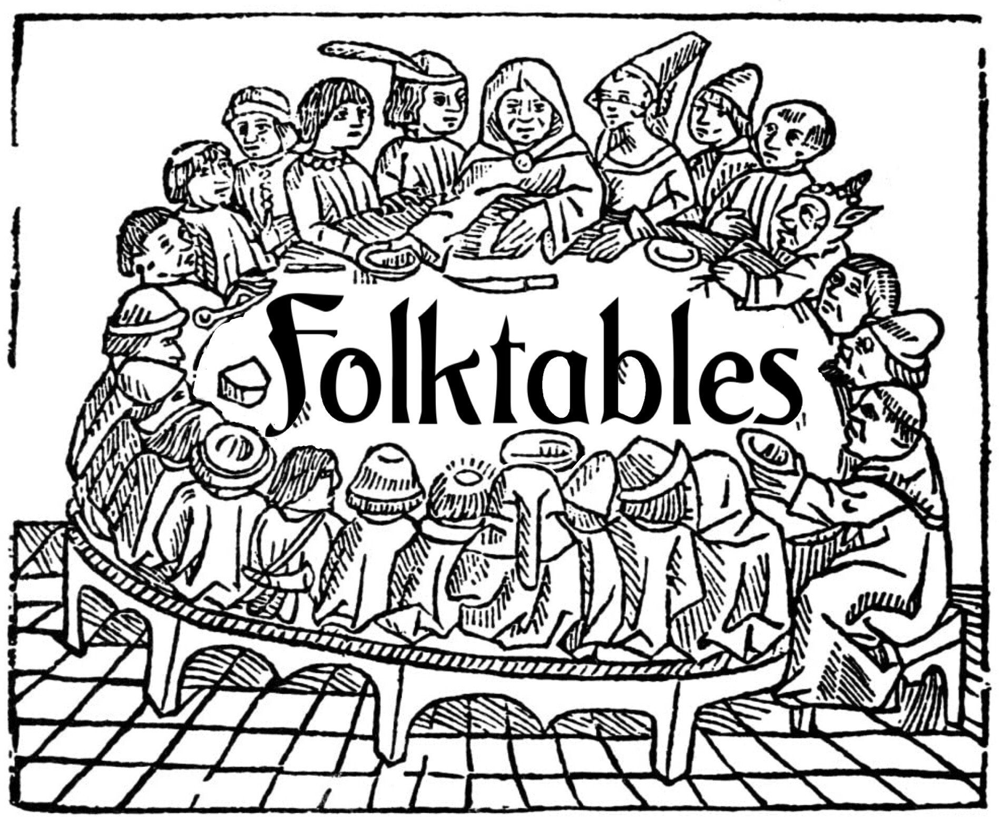

[](https://opensource.org/licenses/MIT)
[](https://pepy.tech/project/folktables)
[](https://pypi.python.org/pypi/folktables)


<p align="center">

</p>

**Folktables** is a Python package that provides access to datasets derived from the US Census, facilitating the benchmarking of machine learning algorithms. The package includes a suite of pre-defined prediction tasks in domains including income, employment, health, transportation, and housing, and also includes tools for creating new prediction tasks of interest in the US Census data ecosystem. The package additionally enables systematic studies of the effect of distribution shift, as each prediction task can be instantiated on datasets spanning multiple years and all states within the US.

Why the name? Folktables is a neologism describing tabular data about individuals. It emphasizes that data has the power to create and shape narratives about populations and challenges us to think carefully about the data we collect and use.

For more information about these datasets, including the motivations behind their curation and some examples of empirical findings, please see [our paper](https://arxiv.org/abs/2108.04884) and/or this [video presentation](https://www.youtube.com/watch?v=KP7DhM_ahHI).


## Table of Contents
1. [Basic installation instructions](#basic-installation-instructions)
2. [Quick start examples](#quick-start-examples)
3. [Prediction tasks in folktables](#prediction-tasks-in-folktables)
5. [Scope and limitations](#scope-and-limitations)
6. [Citing folktables](#citing-folktables)
7. [References](#references)

Folktables is still under active development! If you find bugs or have feature
requests, please file a
[Github issue](https://github.com/zykls/folktables/issues). 
We welcome all kinds of issues, especially those related to correctness, documentation, performance, and new features.

Motivated by [Datasheets for datasets
(Gebru et al.)](https://arxiv.org/abs/1803.09010), please see [[Datasheet]](datasheet.md) for the Folktables datasheet.

## Basic installation instructions
1. (Optionally) create a virtual environment
```
python3 -m venv folkenv
source folkenv/bin/activate
```
2. Install via pip
```
pip install folktables
```
You can also install folktables directly from source.
```
git clone https://github.com/zykls/folktables.git
cd folktables
pip install -r requirements.txt
```


## Quick start examples
Folktables contains a suite of prediction tasks derived from US Census data that
can be easily downloaded and used for a variety of benchmarking tasks.
For information about the features, response, or group membership coding for any
of the datasets, please refer to the [ACS PUMS
documentation](https://www.census.gov/programs-surveys/acs/microdata/documentation.html).


### Evaluating algorithms for fair machine learning
We first construct a data source for the 2018 yearly [American Community
Survey](https://www.census.gov/programs-surveys/acs), download the
corresponding data for Alabama, and use this data to instantiate a
prediction task of interest, for example, the `ACSEmployment` task.
```py
from folktables import ACSDataSource, ACSEmployment

data_source = ACSDataSource(survey_year='2018', horizon='1-Year', survey='person')
acs_data = data_source.get_data(states=["AL"], download=True)
features, label, group = ACSEmployment.df_to_numpy(acs_data)
```
Next we train a simple model on this dataset and use the `group` labels to
evaluate the model's violation of [equality of opportunity](https://fairmlbook.org/), a common fairness
metric.
```py
import numpy as np
from sklearn.linear_model import LogisticRegression
from sklearn.model_selection import train_test_split
from sklearn.pipeline import make_pipeline
from sklearn.preprocessing import StandardScaler

X_train, X_test, y_train, y_test, group_train, group_test = train_test_split(
    features, label, group, test_size=0.2, random_state=0)

###### Your favorite learning algorithm here #####
model = make_pipeline(StandardScaler(), LogisticRegression())
model.fit(X_train, y_train)

yhat = model.predict(X_test)

white_tpr = np.mean(yhat[(y_test == 1) & (group_test == 1)])
black_tpr = np.mean(yhat[(y_test == 1) & (group_test == 2)])

# Equality of opportunity violation: 0.0871
white_tpr - black_tpr
```
The ACS data source contains data for all fifty states, each of which has a
slightly different distribution of features and response. This increases the
diversity of environments in which we can evaluate our methods. For instance, we
can generate another `ACSEmployment` task using data from Texas and repeat the
experiment
```py
acs_tx = data_source.get_data(states=["TX"], download=True)
tx_features, tx_label, tx_group = ACSEmployment.df_to_numpy(acs_tx)

features, label, group = ACSEmployment.df_to_numpy(acs_tx)
X_train, X_test, y_train, y_test, group_train, group_test = train_test_split(
    tx_features, tx_label, tx_group, test_size=0.2, random_state=0)

model = make_pipeline(StandardScaler(), LogisticRegression())
model.fit(X_train, y_train)

yhat = model.predict(X_test)
white_tpr = np.mean(yhat[(y_test == 1) & (group_test == 1)])
black_tpr = np.mean(yhat[(y_test == 1) & (group_test == 2)])

# Equality of opportunity violation: 0.0397
white_tpr - black_tpr
```

### Distribution shift across states
Each prediction problem in Folktables can be instantiated on data from every US
state. This allows us to not just construct a diverse set of test environments,
but also to use Folktables to study questions aroud distribution shift. For
example, we can train a classifier using data from California and then evaluate
it on data from Michigan.
```py
from folktables import ACSDataSource, ACSIncome
from sklearn.linear_model import LogisticRegression

data_source = ACSDataSource(survey_year='2018', horizon='1-Year', survey='person')
ca_data = data_source.get_data(states=["CA"], download=True)
mi_data = data_source.get_data(states=["MI"], download=True)
ca_features, ca_labels, _ = ACSIncome.df_to_numpy(ca_data)
mi_features, mi_labels, _ = ACSIncome.df_to_numpy(mi_data)

# Plug-in your method for tabular datasets
model = LogisticRegression()

# Train on CA data
model.fit(ca_features, ca_labels)

# Test on MI data
model.score(mi_features, mi_labels)
```

### Distribution shift across time
In addition to the variation in distributions across states discussed
previously, Folktables also contains ACS data for several different years, which
itself constitutes a form of _temporal_ distribution shift. For
example, we can train a classifier using data from California in 2014 and
evaluate how it's equality of opportunity violation or accuracy varies over time.
```py
from folktables import ACSDataSource, ACSPublicCoverage
from sklearn.linear_model import LogisticRegression

# Download 2014 data
data_source = ACSDataSource(survey_year=2014, horizon='1-Year', survey='person')
acs_data14 = data_source.get_data(states=["CA"], download=True)
features14, labels14, _ = ACSPublicCoverage.df_to_numpy(acs_data14)

# Train model on 2014 data
# Plug-in your method for tabular datasets
model = LogisticRegression()
model.fit(features14, labels14)

# Evaluate model on 2015-2018 data
accuracies = []
for year in [2015, 2016, 2017, 2018]:
    data_source = ACSDataSource(survey_year=year, horizon='1-Year', survey='person')
    acs_data = data_source.get_data(states=["CA"], download=True)
    features, labels, _ = ACSPublicCoverage.df_to_numpy(acs_data)
    accuracies.append(model.score(features, labels))
```

## Extract data in CSV with pandas
The data can be easily extracted in CSV format from a pandas dataframe.
```py
from folktables import ACSDataSource, ACSIncome

data_source = ACSDataSource(survey_year='2018', horizon='1-Year', survey='person')
ca_data = data_source.get_data(states=["CA"], download=True)

ca_features, ca_labels, _ = ACSIncome.df_to_pandas(ca_data)

ca_features.to_csv('ca_features.csv', index=False)
ca_labels.to_csv('ca_labels.csv', index=False)
```
Take a look at the [examples](examples) for encoding the categorical features with the ```df_to_pandas``` method.

## Prediction tasks in folktables
Folktables provides the following pre-defined prediction tasks:

- **ACSIncome**: predict whether an individual's income is above \$50,000, after filtering the ACS PUMS data sample to only include individuals above the age of 16, who reported usual working hours of at least 1 hour per week in the past year, and an income of at least \$100. The threshold of \$50,000 was chosen so that this dataset can serve as a comparable replacement to the [UCI Adult dataset](https://archive.ics.uci.edu/ml/datasets/adult), but the income threshold can be changed easily to define new prediction tasks. 

- **ACSPublicCoverage**: predict whether an individual is covered by public health insurance, after filtering the ACS PUMS data sample to only include individuals under the age of 65, and those with an income of less than \$30,000. This filtering focuses the prediction problem on low-income individuals who are not eligible for Medicare.

- **ACSMobility**: predict whether an individual had the same residential address one year ago, after filtering the ACS PUMS data sample to only include individuals between the ages of 18 and 35. This filtering increases the difficulty of the prediction task, as the base rate of staying at the same address is above 90\% for the general population. 

- **ACSEmployment**: predict whether an individual is employed, after filtering the ACS PUMS data sample to only include individuals between the ages of 16 and 90. 

- **ACSTravelTime**: predict whether an individual has a commute to work that is longer than 20 minutes, after filtering the ACS PUMS data sample to only include individuals who are employed and above the age of 16. The threshold of 20 minutes was chosen as it is the US-wide median travel time to work  in the 2018 ACS PUMS data release.

Each of these tasks can be instantiated on different ACS PUMS data samples, as
illustrated in the [quick start examples](#quick-start-examples). Further
details about each task can also be found in `acs.py`, where they are defined.
For example, the `ACSIncome` task is defined by a list of the features
that are included 
(`features`), the target variable of interest (`target`), the
transformation applied to that variable (`target_transform`), the group
membership variable (`group`), and any preprocessing or postprocessing functions
(`preprocess` and `postprocess`)  : 

```py
ACSIncome = folktables.BasicProblem(
    features=[
        'AGEP',
        'COW',
        'SCHL',
        'MAR',
        'OCCP',
        'POBP',
        'RELP',
        'WKHP',
        'SEX',
        'RAC1P',
    ],
    target='PINCP',
    target_transform=lambda x: x > 50000,    
    group='RAC1P',
    preprocess=folktables.adult_filter,
    postprocess=lambda x: np.nan_to_num(x, -1),
)
```


### Creating a new prediction task
Folktables also makes it seamless to construct new prediction tasks based on US
Census data. For example, we may be interested in modifying the predefined
`ACSIncome` task by 1) removing the age feature from the task, 2) lowering the
income threshold that determines the binary labels to $25000, and 3) setting the
group membership variable to `'SEX'` instead of `'RAC1P'`. We can define this
new task `ACSIncomeNew` as follows:

```py
ACSIncomeNew = folktables.BasicProblem(
    features=[
        'COW',
        'SCHL',
        'MAR',
        'OCCP',
        'POBP',
        'RELP',
        'WKHP',
        'SEX',
        'RAC1P',
    ],
    target='PINCP',
    target_transform=lambda x: x > 25000,    
    group='SEX',
    preprocess=folktables.adult_filter,
    postprocess=lambda x: np.nan_to_num(x, -1),
)
```

Every field defining the prediction task can be modified, and all variables in
the ACS PUMS data release are valid to include as features or as the target.
Please see the [ACS PUMS data
dictionary](https://www.census.gov/programs-surveys/acs/microdata/documentation.html)
for the full list of variables available. 
Also note that to protect privacy, the Census Bureau adds small perturbations 
to some variables, such as age, and may swap some variable values between 
similar individuals, when those values are relatively uncommon in the general population. 
These perturbations keep marginal statistics unchanged, 
but could affect conclusions drawn about individual predictive accuracy. Please see 
[Accuracy of the PUMS](https://www.census.gov/programs-surveys/acs/microdata/documentation.html) 
and [ASEC documentation](https://www2.census.gov/programs-surveys/cps/techdocs/cpsmar20.pdf) 
for details on such perturbations.


## Scope and limitations
Census data is often used by social scientists to study the extent of inequality
in income, employment, education, housing or other aspects of life. Such
important substantive investigations should necessarily inform debates about
discrimination in classification scenarios within these domains. However,
folktables' contribution is not in this direction. The package uses Census data
for the empirical study of machine learning algorithms that attempt to predict
outcomes for individuals. Folktables may be used to compare different methods on
axes including accuracy, robustness, and fairness metric satisfaction, in an
array of different concrete settings. The distinction we draw between benchmark
data and substantive domain-specific investigations resonates with recent work
that points out issues with using data about risk assessments tools from the
criminal justice domain as machine learning benchmarks [[1]](#1).

Another notable if obvious limitation of our work is that it is entirely
US-centric. A richer dataset ecosystem covering international contexts within
the algorithmic fairness community is still lacking. Although empirical work in
the Global South is central in other disciplines, there continues to be much
need for the North American fairness community to engage with it more strongly
[[2]](#2).


## License and terms of use
Folktables provides code to download data from the American Community Survey
(ACS) Public Use Microdata Sample (PUMS) files managed by the US Census Bureau.
The data itself is governed by the terms of use provided by the Census Bureau.
For more information, see https://www.census.gov/data/developers/about/terms-of-service.html

The Adult reconstruction dataset is a subsample of the IPUMS CPS data available
from https://cps.ipums.org/. The data are intended for replication purposes only.
Individuals analyzing the data for other purposes must submit a separate data
extract request directly via IPUMS CPS. Individuals are not to redistribute the
data without permission. Contact ipums@umn.edu for redistribution requests. 


## Citing folktables
If you use the Folktables datasets or the Adult reconstruction, we encourage
you to cite our paper introducing the datasets:
```
@article{ding2021retiring,
  title={Retiring Adult: New Datasets for Fair Machine Learning},
  author={Ding, Frances and Hardt, Moritz and Miller, John and Schmidt, Ludwig},
  journal={Advances in Neural Information Processing Systems},
  volume={34},
  year={2021}
}
```
If you make use of the Adult Reconstruction, please additionally cite [[3]](#3).

## References
<a id="1">[1]</a> 
M. Bao, A. Zhou, S. Zottola, B. Brubach, S. Desmarais, A. Horowitz, K. Lum, and S. Venkatasubramanian. It’s compaslicated: The messy relationship between RAI datasets and algorithmic fairness benchmarks. arXiv preprint arXiv:2106.05498, 2021.

<a id="2">[2]</a> 
R. Abebe, K. Aruleba, A. Birhane, S. Kingsley, G. Obaido, S. L. Remy, and S. Sadagopan. Narratives and counternarratives on data sharing in Africa. In Proc. of the ACM Conference on Fairness, Accountability, and Transparency, pages 329–341, 2021.

<a id="3">[3]</a> 
S. Flood, M. King, R. Rodgers, S. Ruggles and J. Robert Warren.  Integrated Public Use Microdata Series, Current Population Survey: Version 8.0 [dataset].  Minneapolis, MN: IPUMS, 2020. https://doi.org/10.18128/D030.V8.0
